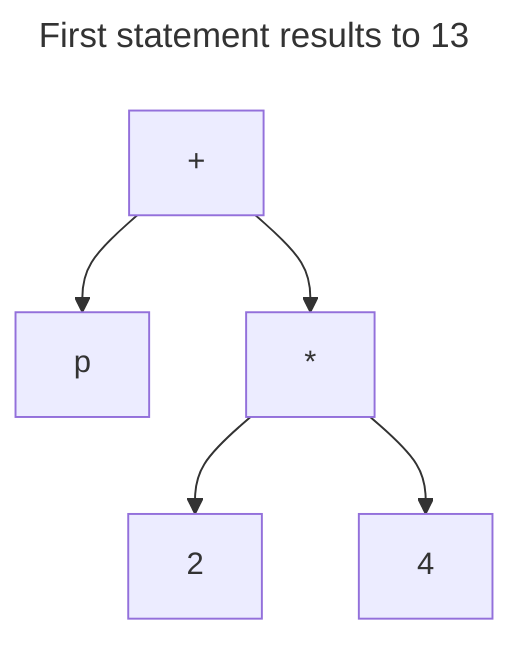
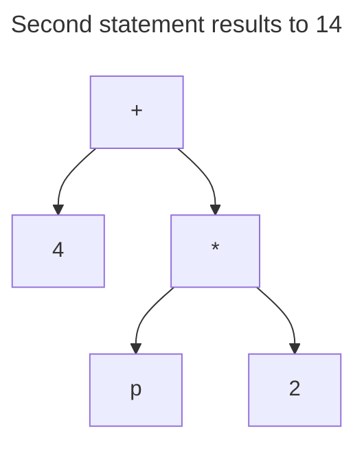

# Chapter #2 Exercises

## 2.7 Fill in the blanks in each of the following statements

1. a) comments.
2. b) `if` statement.
3. c) division `/` and reminder `%`.
4. d) innermost.
5. e) variable.

## 2.8 Write Java statements that accomplish each of the following tasks

1. a)

    ```java
    System.out.print("Enter an integer: ");
    ```

2. b)

    ```java
    int a = b * c;
    ```

3. c)

    ```java
    // Program that performs a sample payroll calculation.
    ```

## 2.9 State whether each of the following is true or false. If false, explain why

1. a) `True`, because parenthesis have a higher precedence.
2. b) `False`, because `X!` has the character `!`, and `a@b` has the character `@`. and a valid identifier consists of upper and lower case letters, numbers, underscores and dollar sign.
3. c) `False`, division has a higher precedence so `5 / 4` will be evaluated first.
4. d) `True`.

## 2.10 What does each of the following statements display

1. a)

    ```bat
    x = 10

    ```

2. b)

    ```bat
    Value of 5 *1 is 5
    
    ```

3. c)

    ```bat
    x is 5 and y is 1
    ```

4. d)

    ```bat
    6 is not equal to 5

    ```

## 2.11 Which of the following Java statements contain variables whose values are not modified

* a) variable p's value isn't modified.
* c) variable p's value isn't modified.
* d) variable k's value isn't modified.

## 2.12 which of the following are correct Java statements for this equation

* a) `y = a * x * x + 5 * x + 2;`
* b) `y = a * x * x + (5 * x) + 2;`
* d) `y = a * (x * x) + 5 * x + 2;`

## 2.13 What is the output that will be printed after execution of the following Java code snippet

```bat
1314
```





## 2.14 Write an application

1. a)

    ```java
    System.out.println("1 2 3 4");
    ```

2. b)

    ```java
    System.out.print("1 2 3 4\n");
    ```

3. c)

    ```java
    System.out.printf("%d %d %d %d%n", 1, 2, 3, 4);
    ```

## 2.15 (Arithmetic) Write an application

```java
// program that takes two integers then make some calculations.

import java.util.Scanner;

public class Arithmetic {
    public static void main(String[] args) {
        Scanner input = new Scanner(System.in);

        System.out.print("Enter first integer: ");
        int number1 = input.nextInt();

        System.out.print("Enter second integer: ");
        int number2 = input.nextInt();

        int num1Squared = number1 * number1;
        int num2Squared = number2 * number2;

        System.out.printf("Square of first integer = %d%n", num1Squared);
        System.out.printf("Square of second integer = %d%n", num2Squared);
        System.out.printf("The sum of the squares = %d%n", num1Squared + num2Squared);
        System.out.printf("The difference of the squares = %d%n", num1Squared - num2Squared);
        
    }
}
```

## 2.16 (Comparing Integers) Write an application

```java
// Program that takes an integer and make some comparisons on the number and its square.

import java.util.Scanner;

public class Compare {
    public static void main(String[] args) {
        Scanner input = new Scanner(System.in);

        System.out.print("Enter an integer: ");
        int num = input.nextInt();
        int square = num * num;

        // case 1: check if the number and its square are greater than 100.
        if (num > 100) {
            // if the num > 100 then for sure (num * num) > 100
            System.out.println("The number and its square are greater than 100.");
        }

        // case 2: check if the number and its square are equal to 100.
        // this case will never happen because if num = 100, then 100 * 100 != 100

        // case 3: check if the number and its square are not equal to 100.
        if (num != 100) {
            if (square != 100) {
                System.out.println("The number and its square are not equal to 100.");
            }
        }

        // case 4: check if the number and its square are less than 100.
        if (num < 100) {
            if (square < 100) {
                System.out.println("The number and its square are less than 100.");
            }
        }
    }
}
```

## 2.17 (Arithmetic, Smallest and Largest) Write an application

```java
// Program that takes three integers, calculate sum, average, smallest and largest.

import java.util.Scanner;

public class Arithmetic {
    public static void main(String[] args) {
        Scanner input = new Scanner(System.in);

        System.out.print("Enter the first number: ");
        int num1 = input.nextInt();

        System.out.print("Enter the second number: ");
        int num2 = input.nextInt();

        System.out.print("Enter the third number: ");
        int num3 = input.nextInt();

        int sum = num1 + num2 + num3;
        int average = sum / 3;
        
        // if there are a number less than the smallest then smallest takes that number.        
        int smallest = num1;
        if (smallest > num2) {
            smallest = num2;
        }
        if (smallest > num3) {
            smallest = num3;
        }

        // if there are a number greater than the largest then largest takes that number.
        int largest = num1;
        if (largest < num2) {
            largest = num2;
        }
        if (largest < num3) {
            largest = num3;
        }

        System.out.printf("Sum of the three number = %d%n", sum);
        System.out.printf("Average of the three number = %d%n", average);
        System.out.printf("Smallest of the three number = %d%n", smallest);
        System.out.printf("largest of the three number = %d%n", largest);
        
    }
}

```

## 2.18 (Displaying Shapes with Asterisks) Write an application

```java
// Program that displays a box, an oval, an arrow and a diamond using asterisks.

public class Shapes {
    public static void main(String[] args) {

        System.out.println("*********     ***       *        *");
        System.out.println("*       *   *     *    ***      * *");
        System.out.println("*       *  *       *  *****    *   *");
        System.out.println("*       *  *       *    *     *     *");
        System.out.println("*       *  *       *    *    *       *");
        System.out.println("*       *  *       *    *     *     *");
        System.out.println("*       *  *       *    *      *   *");
        System.out.println("*       *   *     *     *       * *");
        System.out.println("*********     ***       *        *");
    }

}

```

## 2.19 What does the following code print

```bat
  ****
 ******
*******
 ******
  ****

```

## 2.20 What does the following code print

```bat
*
***
*****
****
**

```

## 2.21 What does the following code print

```bat
***************

```

## 2.22 What does the following code print

```bat
****
*****
******

```

## 2.23 What does the following code print

```bat
  *
 *** 
*****
 ***
  *

```

## 2.24 (Largest and Smallest Integers) Write an application

```java
// Program that determines the largest and smallest among 5 integers

import java.util.Scanner;
public class Finder {
    public static void main(String[] args) {
        Scanner input = new Scanner(System.in);

        System.out.print("Enter 1st integer: ");
        int num1 = input.nextInt();

        System.out.print("Enter 2nd integer: ");
        int num2 = input.nextInt();

        System.out.print("Enter 3rd integer: ");
        int num3 = input.nextInt();

        System.out.print("Enter 4th integer: ");
        int num4 = input.nextInt();

        System.out.print("Enter 5th integer: ");
        int num5 = input.nextInt();

        int smallest = num1;
        if (smallest > num2) {
            smallest = num2;
        }
        if (smallest > num3) {
            smallest = num3;
        }
        if (smallest > num4) {
            smallest = num4;
        }
        if (smallest > num5) {
            smallest = num5;
        }

        int largest = num1;
        if (largest < num2) {
            largest = num2;
        }
        if (largest < num3) {
            largest = num3;
        }
        if (largest < num4) {
            largest = num4;
        }
        if (largest < num5) {
            largest = num5;
        }

        System.out.printf("Smallest = %d, Largest = %d%n", smallest, largest);
    }
}
```

## 2.25 (Divisible by 3) Write an application

```java
// Program that takes a number a check if it's divisible by 3.
import java.util.Scanner;
public class Divisible {
    public static void main(String[] args) {
        Scanner input = new Scanner(System.in);

        System.out.print("Enter an integer: ");
        int number = input.nextInt();

        if (number % 3 == 0) {
            System.out.printf("%d is divisible by 3%n", number);
        }
    }
}
```

## 2.26 (Multiples) Write an application

```java
// Program that  determines whether the first number tripled is a multiple of the second number doubled.
import java.util.Scanner;
public class Multiple {
    public static void main(String[] args) {
        Scanner input = new Scanner(System.in);

        System.out.print("Enter first number: ");
        int num1 = input.nextInt();
        int num1Tripled = num1 * 3;

        System.out.print("Enter second number: ");
        int num2 = input.nextInt();
        int num2Doubled = num2 * 2;

        if (num1Tripled % num2Doubled == 0) {
            System.out.printf("%d tripled is a multiple of %d doubled%n", num1, num2);
        }
    }
}
```

## 2.27 (Checkerboard Pattern of Asterisks) Write an application

```java
// program that prints a checkerboard pattern of asterisks
public class Checkerboard {
    public static void main (String[] args) {
        System.out.println("* * * * * * * *");
        System.out.println(" * * * * * * * *");
        System.out.println("* * * * * * * *");
        System.out.println(" * * * * * * * *");
        System.out.println("* * * * * * * *");
        System.out.println(" * * * * * * * *");
        System.out.println("* * * * * * * *");
        System.out.println(" * * * * * * * *");
    }
}
```

## 2.28 (Diameter, Circumference and Area of a Circle)

```java
// Program that calculates the diameter, circumference and area of a circle using radius.
import java.util.Scanner;
public class Circle {
    public static void main(String[] args) {

        Scanner input = new Scanner(System.in);
        System.out.print("Enter the radius of the circle: ");
        int radius = input.nextInt();

        System.out.printf("diameter = %d%n", radius * 2);
        System.out.printf("circumference = %f%n", 2 * Math.PI * radius);
        System.out.printf("area = %f%n", Math.PI * radius * radius);
    }
}
```

## 2.29 (Integer Value of a Character) 

```java
// Program that displays the integer value of some characters.
public class Caster{
    public static void main(String[] args) {
        System.out.printf("The character %c has the value %d%n", 'A', (int) 'A');
        System.out.printf("The character %c has the value %d%n", 'B', (int) 'B');
        System.out.printf("The character %c has the value %d%n", 'C', (int) 'C');
        System.out.printf("The character %c has the value %d%n", 'a', (int) 'a');
        System.out.printf("The character %c has the value %d%n", 'b', (int) 'b');
        System.out.printf("The character %c has the value %d%n", 'c', (int) 'c');
        System.out.printf("The character %c has the value %d%n", '0', (int) '0');
        System.out.printf("The character %c has the value %d%n", '1', (int) '1');
        System.out.printf("The character %c has the value %d%n", '2', (int) '2');
        System.out.printf("The character %c has the value %d%n", '$', (int) '$');
        System.out.printf("The character %c has the value %d%n", '*', (int) '*');
        System.out.printf("The character %c has the value %d%n", '+', (int) '+');
        System.out.printf("The character %c has the value %d%n", '/', (int) '/');
        System.out.printf("The character %c has the value %d%n", ' ', (int) ' ');

    }
}
```

## 2.30 (Separating the Digits in an Integer)

```java
// Program that given a 5-digits number separates its digits.

import java.util.Scanner;

public class Separator {
    public static void main (String[] args) {
        
        Scanner input = new Scanner(System.in);
        System.out.print("Enter a 5-digit number: ");
        int num = input.nextInt();
        
        int copy = num;
        int digit1 = copy % 10;
        copy = copy / 10;
        int digit2 = copy % 10;
        copy = copy / 10;
        int digit3 = copy % 10;
        copy = copy / 10;
        int digit4 = copy % 10;
        copy = copy / 10;
        int digit5 = copy % 10;

        System.out.printf("%d\t%d\t%d\t%d\t%d%n", digit5, digit4, digit3, digit2, digit1);
    }
}

```
> if you enter a number with more than five digits then all the additional digits won't be printed, and if you enter a number with less than five digits then the remaining digits would be printed as zeros.

## 2.31 (Table of Squares and Cubes)

```java
// Program that prints a table of numbers from 0 to 10 with its square and cube.
public class Table {
    public static void main(String[] args) {

        System.out.printf("%s\t%s\t%s%n", "number", "square", "cube");
        int num = 0;
        System.out.printf("%d\t\t%d\t\t%d%n", num, num * num, num * num * num);
        num = 1;
        System.out.printf("%d\t\t%d\t\t%d%n", num, num * num, num * num * num);
        num = 2;
        System.out.printf("%d\t\t%d\t\t%d%n", num, num * num, num * num * num);
        num = 3;
        System.out.printf("%d\t\t%d\t\t%d%n", num, num * num, num * num * num);
        num = 4;
        System.out.printf("%d\t\t%d\t\t%d%n", num, num * num, num * num * num);
        num = 5;
        System.out.printf("%d\t\t%d\t\t%d%n", num, num * num, num * num * num);
        num = 6;
        System.out.printf("%d\t\t%d\t\t%d%n", num, num * num, num * num * num);
        num = 7;
        System.out.printf("%d\t\t%d\t\t%d%n", num, num * num, num * num * num);
        num = 8;
        System.out.printf("%d\t\t%d\t\t%d%n", num, num * num, num * num * num);
        num = 9;
        System.out.printf("%d\t\t%d\t\t%d%n", num, num * num, num * num * num);
        num = 10;
        System.out.printf("%d\t\t%d\t\t%d%n", num, num * num, num * num * num);
    }
}
```

## 2.32 (Negative, Positive and Zero Values)

```java
// A program that takes 5 integers and determines the number of negative, positive and zeros.
import java.util.Scanner;
public class Counter {
    public static void main(String[] args) {
        Scanner input = new Scanner(System.in);

        System.out.print("Enter 1st integer: ");
        int num1 = input.nextInt();

        System.out.print("Enter 2nd integer: ");
        int num2 = input.nextInt();

        System.out.print("Enter 3rd integer: ");
        int num3 = input.nextInt();

        System.out.print("Enter 4th integer: ");
        int num4 = input.nextInt();

        System.out.print("Enter 5th integer: ");
        int num5 = input.nextInt();

        int positive = 0;
        int negative = 0;
        int zeros = 0;

        if (num1 < 0) {
            negative = negative + 1;
        }
        if (num1 == 0) {
            zeros = zeros + 1;
        }
        if (num1 > 0) {
            positive = positive + 1;
        }
        if (num2 < 0) {
            negative = negative + 1;
        }
        if (num2 == 0) {
            zeros = zeros + 1;
        }
        if (num2 > 0) {
            positive = positive + 1;
        }
        if (num3 < 0) {
            negative = negative + 1;
        }
        if (num3 == 0) {
            zeros = zeros + 1;
        }
        if (num3 > 0) {
            positive = positive + 1;
        }
        if (num4 < 0) {
            negative = negative + 1;
        }
        if (num4 == 0) {
            zeros = zeros + 1;
        }
        if (num4 > 0) {
            positive = positive + 1;
        }
        if (num5 < 0) {
            negative = negative + 1;
        }
        if (num5 == 0) {
            zeros = zeros + 1;
        }
        if (num5 > 0) {
            positive = positive + 1;
        }
        System.out.printf("Number of negatives = %d, zeros = %d, positives = %d%n", negative, zeros, positive);
    }
}
```